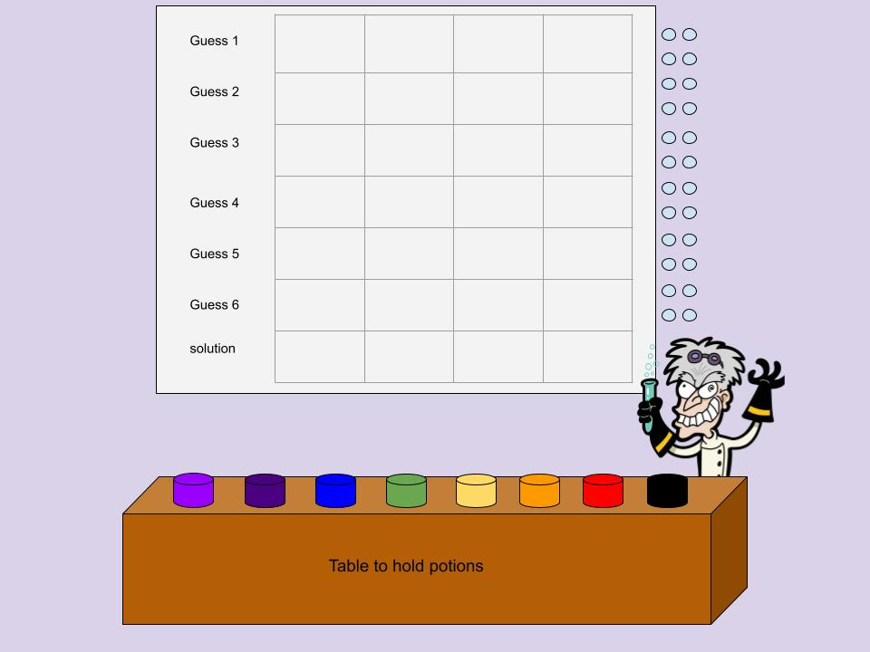

# project1-mastermind

# Title/Theme

Power, Potions & Destruction — oh my! (Mastermind)

Creating the perfect potion to give yourself the ultimate superpowers, but only at the recommendation of the mad scientist!

# Code Graphic Options

Using the 7 chakra colors:
	
	chakra colors:
	purple - mind reading
	indigo - psychic ability
	blue - vocal reality manipulation
	green - healing touch
	yellow - energetic pressure
	orange - emotion control
	red - shape shifting

# How to play

## Basic how to play (not extensive): 

You are creating a potion to give yourself superpowers but you have to guess which potion combo is correct. There are 7 different potions that give different powers. You have 6 times to get it correct. If you get all 6 wrong, then it's game over, and the mad scientist gets to keep your potion secrets! If you get the combination correct within the 6 tries, you get to keep the potion, but the mad scientist is NOT happy!

Keep in mind, the mad scientist will not use the same color twice! He will also tell you if

On the right side (col 5), each box for each row will show red if it's incorrect, or green if it's correct! 

p.s. this game is similar to wordle, you are trying to guess what code combination the computer has in their mind, but it will help you along the way!
		
